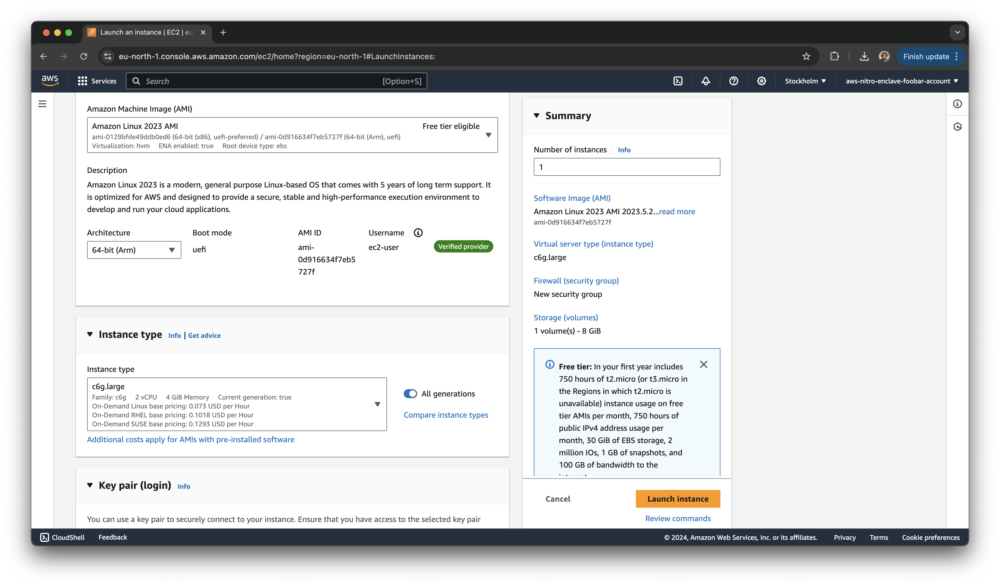

# AWS Setup

This document describes how to manually setup AWS in order to run
foobar-service.

1. [Create an AWS account](https://aws.amazon.com/resources/create-account/).
    1. Provide your email address and pick an account name.

    

    2. Receive a code via email to confirm your email address.

    

    3. Pick a password.

    

    4. Provide your personal information.

    

    5. Provide billing information.

    

    6. Solve a captcha and provide your phone number.

    

    7. Receive a code via SMS to confirm your phone number.

    

    8. Pick a support plan. Basic (free) will do.

    

2. [Create an EC2 keypair](https://console.aws.amazon.com/ec2/home#CreateKeyPair:)

    The keypair will be used to ssh into your EC2 instance. You can pick either algorithm.

    

3. [Create an IAM role](https://console.aws.amazon.com/iam/home?#/roles/create)

    The role will allow your EC2 instance to create KMS keys. Pick EC2 as the use-case to get a default configuration.

    

    Add AWS Key Management Service as the policy.

    

    

4. [Create EC2 instance](https://console.aws.amazon.com/ec2/home?#LaunchInstances:)

    

    The documentation around which EC2 instances have Nitro Enclaves is misleading. Per [Instances built on the AWS Nitro System](https://docs.aws.amazon.com/ec2/latest/instancetypes/ec2-nitro-instances) you should be able to use any C6g. However, per [What is Nitro Enclaves?](https://docs.aws.amazon.com/enclaves/latest/user/nitro-enclave.html#nitro-enclave-reqs), you need at least 2 vCPUs. The web interface will let you pick incorrect configurations but will subsequently fail to launch. The cheapest option is currently a c6g.large instance.

    Pick 64-bit (Arm) for the architecture.

    

    Pick the keypair you previously created.

    

    Pick the IAM role you previously created.

    

    Make sure you enable "Nitro Enclave" under "Advanced details".

    

6. ssh into the enclave, build & deploy
    ```bash
    chmod og-rw aws-nitro-enclave-foobar-keypair.pem
    ssh -i aws-nitro-enclave-foobar-keypair.pem ec2-user@$NITRO_INSTANCE_IP

    $ sudo dnf install git -y
    $ sudo dnf install aws-nitro-enclaves-cli -y
    $ sudo dnf install aws-nitro-enclaves-cli-devel -y
    $ sudo usermod -aG ne ec2-user
    $ sudo usermod -aG docker ec2-user
    $ sudo systemctl enable docker
    $ sudo systemctl start docker
    $ exit
    ssh -i aws-nitro-enclave-foobar-keypair.pem ec2-user@$NITRO_INSTANCE_IP

    $ sudo vi /etc/nitro_enclaves/allocator.yaml
    => change to 1
    $ sudo systemctl enable --now nitro-enclaves-allocator.service

    $ git clone https://github.com/zxsdotch/aws-nitro-enclave-foobar-service.git
    $ cd aws-nitro-enclave-foobar-service
    $ ./build-and-run-enclave.sh
    $ cd foobar-instance
    $ sudo dnf install golang -y
    $ go build .
    $ sudo ./foobar-instance create-key --role="aws-nitro-enclave-foobar-iam-role"
    $ CIPHERTEXT=`./foobar-instance encrypt --plaintext="attack at dawn"`
    $ ./foobar-instance decrypt --ciphertext=$CIPHERTEXT
    ```

Don't forget to delete the KMS key and any other resources you don't need.
